# Mermaid Workflow Pipeline: Partitioned Android Virtualization

## Overview

This document provides comprehensive Mermaid workflows for implementing the novel partitioned Android virtualization approach. These workflows can be used to generate prompts and guide step-by-step implementation processes.

## 1. High-Level Architecture Workflow


## 2. Detailed Implementation Pipeline

```mermaid
flowchart TD
    Start([🚀 Begin Implementation]) --> DeviceID{Identify Device Model}
    
    DeviceID --> |SM-G965U1| GalaxyS9[Galaxy S9+ Pipeline]
    DeviceID --> |SM-G973F| GalaxyS10[Galaxy S10 Pipeline]
    DeviceID --> |Generic| GenericAndroid[Generic Android Pipeline]
    
    GalaxyS9 --> FirmwareAcq[📥 Firmware Acquisition]
    GalaxyS10 --> FirmwareAcq
    GenericAndroid --> FirmwareAcq
    
    FirmwareAcq --> ValidateFW{Validate Firmware}
    ValidateFW --> |✅ Valid| ExtractSystem[🔧 Extract System Image]
    ValidateFW --> |❌ Invalid| FirmwareAcq
    
    ExtractSystem --> ExtractSteps[Extract Steps]
    
    subgraph ExtractSteps[System Image Extraction Process]
        E1[unzip AP*.tar.md5] --> E2[tar -xf system.img.lz4]
        E2 --> E3[lz4 -d decompress]
        E3 --> E4[simg2img convert]
        E4 --> E5[✅ system.img ready]
    end
    
    E5 --> CreatePartition[🏗️ Create Partition Structure]
    
    subgraph CreatePartition[Partition Creation]
        P1[mkdir system_ro] --> P2[mkdir upper]
        P2 --> P3[mkdir work]
        P3 --> P4[mkdir merged]
    end
    
    P4 --> MountBase[📎 Mount Base System]
    MountBase --> MountOverlay[📎 Mount OverlayFS]
    
    subgraph MountOverlay[OverlayFS Configuration]
        O1[mount -o loop system.img system_ro] --> O2[mount -t overlay]
        O2 --> O3[lowerdir=system_ro]
        O3 --> O4[upperdir=upper]
        O4 --> O5[workdir=work]
        O5 --> O6[target=merged]
    end
    
    O6 --> ConfigPRoot[⚙️ Configure PRoot]
    
    subgraph ConfigPRoot[PRoot Environment Setup]
        PR1[Set PROOT_NO_SECCOMP=1] --> PR2[Configure bind mounts]
        PR2 --> PR3[Set working directory]
        PR3 --> PR4[Set entry shell]
    end
    
    PR4 --> TestEnv{🧪 Test Environment}
    TestEnv --> |✅ Success| Deploy[🚀 Deploy Application]
    TestEnv --> |❌ Failed| Debug[🐛 Debug Issues]
    Debug --> ConfigPRoot
    
    Deploy --> Monitor[📊 Monitor & Manage]
    
    subgraph Monitor[Monitoring & Management]
        M1[Resource Usage] --> M2[Process Monitoring]
        M2 --> M3[Storage Tracking]
        M3 --> M4[Performance Metrics]
    end
    
    M4 --> Scale{Scale Needed?}
    Scale --> |Yes| Orchestrate[🎼 Orchestration]
    Scale --> |No| Maintain[🔧 Maintenance]
    
    subgraph Orchestrate[Multi-Partition Orchestration]
        OR1[Create Additional Partitions] --> OR2[Load Balancing]
        OR2 --> OR3[Resource Allocation]
        OR3 --> OR4[Health Checks]
    end
    
    OR4 --> Production[🏭 Production Ready]
    Maintain --> Production
    
    style Start fill:#4caf50,color:#fff
    style Production fill:#2196f3,color:#fff
    style ValidateFW fill:#ff9800,color:#fff
    style TestEnv fill:#ff9800,color:#fff
    style Scale fill:#ff9800,color:#fff
```



## 3. Development Workflow Pipeline

```mermaid
gitgraph
    commit id: "Project Init"
    branch firmware-extraction
    commit id: "Download Firmware"
    commit id: "Extract System Image"
    commit id: "Validate Extraction"
    checkout main
    merge firmware-extraction
    
    branch partition-setup
    commit id: "Create Directory Structure"
    commit id: "Configure OverlayFS"
    commit id: "Test Mount Operations"
    checkout main
    merge partition-setup
    
    branch proot-config
    commit id: "Configure PRoot Environment"
    commit id: "Set Security Policies"
    commit id: "Test Isolation"
    checkout main
    merge proot-config
    
    branch application-layer
    commit id: "Deploy Test Application"
    commit id: "Performance Testing"
    commit id: "Security Validation"
    checkout main
    merge application-layer
    
    branch production-ready
    commit id: "Monitoring Setup"
    commit id: "Orchestration Layer"
    commit id: "Documentation"
    checkout main
    merge production-ready
    
    commit id: "Production Release"
```

## 4. CI/CD Integration Workflow

```mermaid
graph LR
    A[Code Commit] --> B[Trigger CI]
    B --> C{Change Type?}
    
    C --> |Firmware Update| D[Firmware Pipeline]
    C --> |App Update| E[Application Pipeline]
    C --> |Config Update| F[Configuration Pipeline]
    
    subgraph D[Firmware Update Pipeline]
        D1[Download New Firmware] --> D2[Extract & Validate]
        D2 --> D3[Create Test Partition]
        D3 --> D4[Compatibility Tests]
        D4 --> D5[Security Scan]
    end
    
    subgraph E[Application Pipeline]
        E1[Build Application] --> E2[Create Partition]
        E2 --> E3[Deploy to Partition]
        E3 --> E4[Integration Tests]
        E4 --> E5[Performance Tests]
    end
    
    subgraph F[Configuration Pipeline]
        F1[Validate Config] --> F2[Apply to Test Partition]
        F2 --> F3[Functional Tests]
        F3 --> F4[Security Validation]
    end
    
    D5 --> G{All Tests Pass?}
    E5 --> G
    F4 --> G
    
    G --> |✅ Yes| H[Deploy to Staging]
    G --> |❌ No| I[Rollback & Alert]
    
    H --> J[Staging Tests]
    J --> K{Staging OK?}
    K --> |✅ Yes| L[Production Deployment]
    K --> |❌ No| I
    
    L --> M[Monitor Production]
    I --> N[Fix Issues]
    N --> A
    
    style A fill:#4caf50,color:#fff
    style L fill:#2196f3,color:#fff
    style I fill:#f44336,color:#fff
```



## 5. Resource Management Workflow

```mermaid
graph TD
    Start[System Resource Check] --> CPU{CPU Available?}
    CPU --> |✅ Yes| Memory{Memory Available?}
    CPU --> |❌ No| WaitCPU[Wait for CPU]
    WaitCPU --> CPU
    
    Memory --> |✅ Yes| Storage{Storage Available?}
    Memory --> |❌ No| WaitMem[Wait for Memory]
    WaitMem --> Memory
    
    Storage --> |✅ Yes| CreatePartition[Create New Partition]
    Storage --> |❌ No| Cleanup[Cleanup Old Partitions]
    Cleanup --> Storage
    
    CreatePartition --> Mount[Mount OverlayFS]
    Mount --> StartPRoot[Start PRoot Environment]
    StartPRoot --> HealthCheck{Health Check}
    
    HealthCheck --> |✅ Healthy| Ready[Partition Ready]
    HealthCheck --> |❌ Unhealthy| Debug[Debug Issues]
    Debug --> Retry{Retry?}
    Retry --> |Yes| CreatePartition
    Retry --> |No| Fail[Report Failure]
    
    Ready --> Monitor[Monitor Resources]
    Monitor --> Usage{Resource Usage}
    Usage --> |Normal| Continue[Continue Operation]
    Usage --> |High| Scale[Consider Scaling]
    Usage --> |Critical| Alert[Send Alert]
    
    Scale --> AddPartition{Add Partition?}
    AddPartition --> |Yes| CreatePartition
    AddPartition --> |No| Optimize[Optimize Current]
    
    Alert --> Investigate[Investigate Issue]
    Investigate --> Resolve[Resolve Problem]
    Resolve --> Monitor
    
    Continue --> Monitor
    Optimize --> Monitor
    
    style Start fill:#4caf50,color:#fff
    style Ready fill:#2196f3,color:#fff
    style Fail fill:#f44336,color:#fff
    style Alert fill:#ff9800,color:#fff
```



## 6. Security & Compliance Workflow

```mermaid
graph TB
    Security[Security Assessment] --> FirmwareAuth{Firmware Authentic?}
    
    FirmwareAuth --> |✅ Yes| SignatureCheck[Verify Signatures]
    FirmwareAuth --> |❌ No| Reject[Reject Firmware]
    
    SignatureCheck --> IntegrityCheck[Integrity Validation]
    IntegrityCheck --> IsolationTest[Test Isolation]
    
    subgraph IsolationTest[Isolation Testing]
        I1[Test Namespace Isolation] --> I2[Test Filesystem Isolation]
        I2 --> I3[Test Process Isolation]
        I3 --> I4[Test Network Isolation]
    end
    
    I4 --> VulnScan[Vulnerability Scanning]
    VulnScan --> ComplianceCheck[Compliance Validation]
    
    subgraph ComplianceCheck[Compliance Checks]
        C1[GDPR Compliance] --> C2[Security Standards]
        C2 --> C3[Licensing Validation]
        C3 --> C4[Audit Trail]
    end
    
    C4 --> SecurityApproval{Security Approved?}
    SecurityApproval --> |✅ Yes| Production[Deploy to Production]
    SecurityApproval --> |❌ No| Remediate[Remediate Issues]
    
    Remediate --> Security
    Reject --> Alert[Security Alert]
    
    Production --> ContinuousMonitor[Continuous Security Monitoring]
    ContinuousMonitor --> ThreatDetection[Threat Detection]
    ThreatDetection --> IncidentResponse[Incident Response]
    
    style Security fill:#4caf50,color:#fff
    style Production fill:#2196f3,color:#fff
    style Reject fill:#f44336,color:#fff
    style Alert fill:#f44336,color:#fff
```



## 7. Workflow Prompt Generation Template

### For AI/LLM Integration


## Usage Examples

### 1. Prompt for Initial Setup
```
Based on the setup workflow, generate a comprehensive prompt for:
- Device: Galaxy S9+ (SM-G965U1)
- Purpose: Development environment
- Requirements: Android 10, isolated testing
- Timeline: 1 hour setup
```

### 2. Prompt for CI/CD Integration
```
Based on the CI/CD workflow, generate prompts for:
- Automated firmware updates
- Application deployment pipeline
- Testing integration with existing DevOps tools
- Rollback strategies
```

### 3. Prompt for Production Deployment
```
Based on the production workflow, generate prompts for:
- Multi-tenant environment setup
- Resource management at scale
- Security compliance validation
- Monitoring and alerting systems
```

## Integration with Existing Tools

These workflows can be integrated with:
- **GitHub Actions** - For CI/CD automation
- **Terraform** - For infrastructure as code
- **Kubernetes** - For container orchestration
- **Ansible** - For configuration management
- **Prometheus** - For monitoring and alerting

## Next Steps

1. **Customize workflows** for specific use cases
2. **Generate prompts** using the templates above
3. **Implement automation** based on the workflows
4. **Monitor and optimize** based on real-world usage
5. **Scale horizontally** using orchestration patterns