# SMC-Enhanced Mermaid Workflow Integration

## Overview

This document extends the Mermaid Workflow Pipeline to include SMC (State Machine Compiler) integration for generating FSM-based workorder jobs. This creates a complete workflow from Mermaid visualization to executable FSM code across multiple languages.

## Enhanced Workflow: Mermaid → SMC → Multi-Language FSM


## SMC-Enhanced Implementation Pipeline

```mermaid
flowchart TD
    Start([🚀 Begin Enhanced Implementation]) --> MermaidDesign[📊 Create Mermaid Workflows]
    
    MermaidDesign --> FSMDesign[🎯 Design State Machines]
    FSMDesign --> SMCInstall{SMC Installed?}
    
    SMCInstall --> |❌ No| InstallSMC[📥 Install SMC Pipeline]
    SMCInstall --> |✅ Yes| CreateSM[📝 Create .sm Files]
    InstallSMC --> CreateSM
    
    CreateSM --> ValidateSM{Validate SM Files}
    ValidateSM --> |❌ Invalid| FixSM[🔧 Fix State Machine]
    ValidateSM --> |✅ Valid| CompileSMC[⚙️ Compile with SMC]
    FixSM --> ValidateSM
    
    CompileSMC --> MultiLangGen[🔄 Multi-Language Generation]
    
    subgraph MultiLangGen[Multi-Language Code Generation]
        ML1[Generate Kotlin Code] --> ML2[Generate React Native Bridge]
        ML2 --> ML3[Generate SQL Backend]
        ML3 --> ML4[Generate C++ Performance Code]
        ML4 --> ML5[Generate Java Enterprise Code]
    end
    
    ML5 --> MCPIntegration[🌉 MCP Bridge Setup]
    
    subgraph MCPIntegration[MCP Bridge Integration]
        MCP1[Initialize MCP Bridge] --> MCP2[Configure FSM Routing]
        MCP2 --> MCP3[Setup Event Handlers]
        MCP3 --> MCP4[Test Communication]
    end
    
    MCP4 --> WorkorderSetup[📋 Workorder Job Setup]
    
    subgraph WorkorderSetup[Workorder Job Configuration]
        WO1[Define Job Templates] --> WO2[Configure Orchestration]
        WO2 --> WO3[Setup State Persistence]
        WO3 --> WO4[Configure Error Handling]
    end
    
    WO4 --> TestIntegration{🧪 Test Integration}
    TestIntegration --> |❌ Failed| Debug[🐛 Debug Issues]
    TestIntegration --> |✅ Success| DeployBots[🤖 Deploy Bot Army]
    Debug --> MCPIntegration
    
    DeployBots --> Monitor[📊 Monitor & Orchestrate]
    
    subgraph Monitor[Monitoring & Orchestration]
        MON1[FSM State Monitoring] --> MON2[Performance Metrics]
        MON2 --> MON3[Error Tracking]
        MON3 --> MON4[Auto-scaling]
    end
    
    MON4 --> Production[🏭 Production Bot Army]
    
    style Start fill:#4caf50,color:#fff
    style Production fill:#2196f3,color:#fff
    style SMCInstall fill:#ff9800,color:#fff
    style TestIntegration fill:#ff9800,color:#fff
```



## FSM Workorder Job Pipeline


## MCP-to-SMC Integration Architecture


## Multi-Language FSM Integration


## Workflow Generation Commands

### Enhanced Workflow Prompt Generator

The existing `workflow_prompt_generator.sh` is extended with SMC capabilities:

```bash
# Generate SMC FSM workflows
./workflow_prompt_generator.sh smc workorder kotlin medium
./workflow_prompt_generator.sh smc android-partition react-native high
./workflow_prompt_generator.sh smc mcp-bridge sql enterprise

# Generate complete Mermaid + SMC workflows
./workflow_prompt_generator.sh enhanced-all workorder-orchestration
```

### SMC Pipeline Commands

```bash
# Install SMC and setup FSM structure
./smc_pipeline.sh install

# Compile specific FSMs
./smc_pipeline.sh compile AndroidPartitionBot.sm kotlin
./smc_pipeline.sh compile WorkorderJob.sm react-native
./smc_pipeline.sh generate-sql MCPBridge.sm

# Test installation
./smc_pipeline.sh test
./smc_pipeline.sh status
```

### Workflow Compilation Commands

```bash
# Compile all FSMs to all languages
./workflows/compile_smc.sh all

# Generate documentation and diagrams
./workflows/compile_smc.sh docs

# Compile only FSM code
./workflows/compile_smc.sh compile
```

## Integration Benefits

### 1. **Language-Agnostic State Management**
- Single `.sm` file generates code for all target languages
- Consistent FSM behavior across platforms
- Centralized state logic maintenance

### 2. **MCP Bridge Integration**
- Seamless command routing from Gemini CLI
- Event-driven FSM transitions
- Persistent state management

### 3. **Multi-Platform Deployment**
- Kotlin Native for Android devices
- React Native for cross-platform mobile
- SQL backend for enterprise persistence
- C++ modules for high-performance computing

### 4. **Workorder Job Orchestration**
- FSM-driven job lifecycle management
- Automatic state transitions and error handling
- Resource allocation and cleanup

### 5. **Edge Computing Bot Army**
- Distributed FSM instances across devices
- Coordinated state management
- Fault-tolerant operation

## Example Usage Scenario

1. **Design Phase**: Create Mermaid workflows for partition management
2. **FSM Definition**: Define `.sm` files for workorder processing
3. **Code Generation**: Compile FSMs to Kotlin, React Native, and SQL
4. **MCP Integration**: Deploy MCP bridge for command handling
5. **Bot Deployment**: Deploy FSM instances to edge devices
6. **Orchestration**: Coordinate workorder jobs across bot army
7. **Monitoring**: Track FSM states and performance metrics

This enhanced workflow system provides a complete pipeline from visual design through executable, distributed FSM implementations for robust edge computing orchestration.