# Workorder Processing Pipeline - Mermaid Design

## High-Level Workorder Flow

```mermaid
graph TB
    A[📋 Workorder Created] --> B{Validate Request}
    B --> |✅ Valid| C[🎯 Assign to Bot]
    B --> |❌ Invalid| D[❌ Reject Request]
    
    C --> E[🤖 Bot Accepts Job]
    E --> F[🚀 Start Execution]
    F --> G[📊 Monitor Progress]
    G --> H{Job Status}
    
    H --> |In Progress| G
    H --> |Completed| I[✅ Mark Complete]
    H --> |Failed| J[❌ Handle Failure]
    
    I --> K[📁 Archive Results]
    J --> L{Retry?}
    L --> |Yes| C
    L --> |No| M[❌ Mark Failed]
    
    K --> N[🏁 End Success]
    M --> O[🏁 End Failed]
    D --> P[🏁 End Rejected]
    
    style A fill:#e1f5fe
    style N fill:#c8e6c9
    style O fill:#ffcdd2
    style P fill:#ffcdd2
```

## Bot Partition Management Flow

## Integration Architecture

This Mermaid design will be converted to SMC state machines for implementation.
